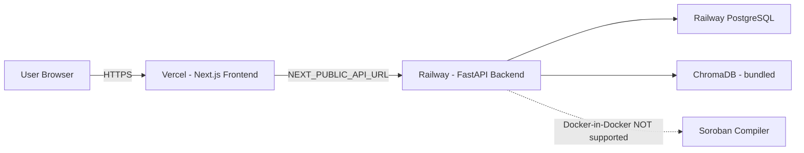

# Deploy Halo to Vercel (Frontend) + Railway (Backend)

Your project has two parts: a **Next.js 14 frontend** and a **FastAPI + PostgreSQL backend**. Vercel is perfect for the frontend, but the backend needs a platform that supports Python + Docker -- Railway is the best fit.

## Architecture




## Important Limitation: Docker-in-Docker

The Soroban smart contract **compilation service** ([backend/app/services/compiler.py](backend/app/services/compiler.py)) uses Docker-in-Docker (mounting `/var/run/docker.sock`) to spin up Rust containers that compile WASM. **Railway does not support Docker socket access**, so compilation will fail in production. Everything else (AI generation, code preview, deploying pre-compiled contracts) will work. If you need compilation in prod later, you'd need a dedicated VPS or a remote build service.

---

## Part 1: Backend Code Changes (before deploying)

### 1a. Update CORS to allow your Vercel domain

In [backend/app/main.py](backend/app/main.py), change the hardcoded CORS origins to also accept your Vercel URL:

```python
import os

allowed_origins = [
    "http://localhost:3000",
    "http://127.0.0.1:3000",
]
# Add production frontend URL from env
frontend_url = os.environ.get("FRONTEND_URL")
if frontend_url:
    allowed_origins.append(frontend_url)

app.add_middleware(
    CORSMiddleware,
    allow_origins=allowed_origins,
    ...
)
```

### 1b. Update Dockerfile for production

In [backend/Dockerfile](backend/Dockerfile), remove `--reload` (dev-only flag) and include the `knowledge/` directory for ChromaDB:

```dockerfile
FROM python:3.11-slim
WORKDIR /app
RUN apt-get update && apt-get install -y gcc libpq-dev && rm -rf /var/lib/apt/lists/*
COPY requirements.txt .
RUN pip install --no-cache-dir -r requirements.txt
COPY . .
EXPOSE 8000
CMD ["uvicorn", "app.main:app", "--host", "0.0.0.0", "--port", "8000"]
```

### 1c. Add a `.dockerignore` in `backend/`

To keep the Docker image clean and avoid sending unnecessary files:

```
__pycache__
*.pyc
.env
builds/
tests/
```

---

## Part 2: Deploy Backend to Railway

### 2a. Create Railway project

1. Go to [railway.app](https://railway.app) and sign in with GitHub
2. Click **"New Project"** -> **"Deploy from GitHub Repo"**
3. Select the `halo` repo
4. Railway will auto-detect the Dockerfile -- set the **Root Directory** to `backend`

### 2b. Add PostgreSQL

1. In the Railway project, click **"+ New"** -> **"Database"** -> **"PostgreSQL"**
2. Railway provides a `DATABASE_URL` automatically -- reference it using `${{Postgres.DATABASE_URL}}` in your backend service variables

### 2c. Set environment variables on the backend service


| Variable                    | Value                                                   |
| --------------------------- | ------------------------------------------------------- |
| `DATABASE_URL`              | `${{Postgres.DATABASE_URL}}` (Railway reference)        |
| `GITHUB_TOKEN`              | Your actual token                                       |
| `OPENAI_MODEL`              | `openai/gpt-5`                                          |
| `OPENAI_ENDPOINT`           | `https://models.github.ai/inference`                    |
| `EMBEDDING_MODEL`           | `all-MiniLM-L6-v2`                                      |
| `CHROMA_PERSIST_DIR`        | `./knowledge/chroma_db`                                 |
| `STELLAR_NETWORK`           | `testnet`                                               |
| `STELLAR_HORIZON_URL`       | `https://horizon-testnet.stellar.org`                   |
| `STELLAR_SOROBAN_RPC_URL`   | `https://soroban-testnet.stellar.org`                   |
| `STELLAR_HOT_WALLET_SECRET` | Your wallet secret                                      |
| `FRONTEND_URL`              | `https://halo-xxx.vercel.app` (set after Vercel deploy) |


### 2d. Generate a public domain

In Railway, go to your backend service -> **Settings** -> **Networking** -> **Generate Domain**. This gives you a URL like `halo-backend-production.up.railway.app`. Note this URL.

---

## Part 3: Deploy Frontend to Vercel

### 3a. Deploy via Vercel CLI or Dashboard

**Option A -- Vercel Dashboard (easiest):**

1. Go to [vercel.com](https://vercel.com), sign in with GitHub
2. Click **"Add New Project"** -> Import the `halo` repo
3. Set **Root Directory** to `frontend`
4. Framework preset will auto-detect as **Next.js**

**Option B -- Vercel CLI:**

```bash
cd frontend
npx vercel --prod
```

### 3b. Set environment variable on Vercel


| Variable              | Value                                                               |
| --------------------- | ------------------------------------------------------------------- |
| `NEXT_PUBLIC_API_URL` | `https://halo-backend-production.up.railway.app` (your Railway URL) |


**Important**: Since `NEXT_PUBLIC_API_URL` is a build-time variable (prefixed with `NEXT_PUBLIC_`), you must set it **before** building/deploying. If you set it after, trigger a redeploy.

### 3c. Update Railway CORS after Vercel deploy

Once you have your Vercel URL (e.g., `https://halo.vercel.app`), go back to Railway and set the `FRONTEND_URL` env var to that URL. The backend service will auto-redeploy.

---

## Summary of Files to Change


| File                                       | Change                                              |
| ------------------------------------------ | --------------------------------------------------- |
| [backend/app/main.py](backend/app/main.py) | Add dynamic CORS origin from `FRONTEND_URL` env var |
| [backend/Dockerfile](backend/Dockerfile)   | Remove `--reload` flag for production               |
| `backend/.dockerignore` (new)              | Exclude unnecessary files from Docker build         |


That's it -- only 3 files need changes. The rest is configuration on Vercel and Railway dashboards.