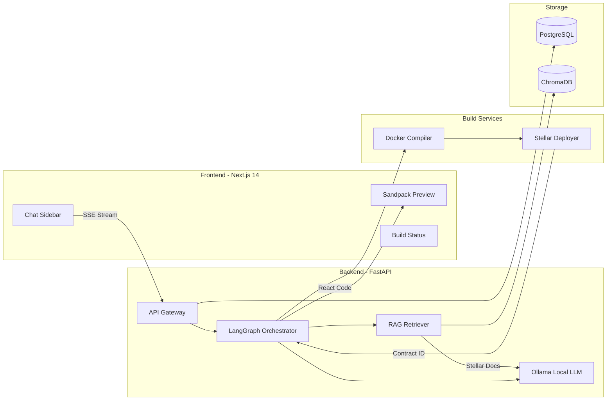
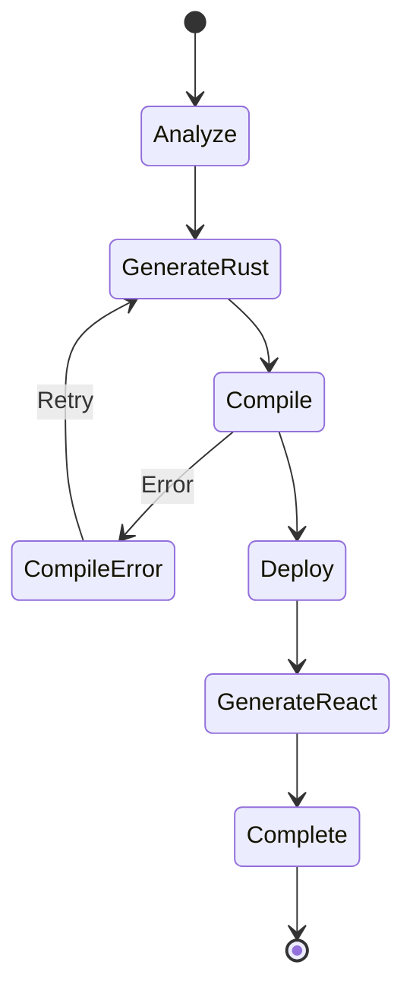
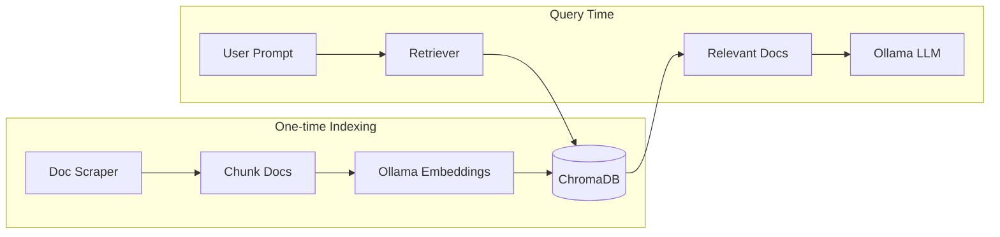
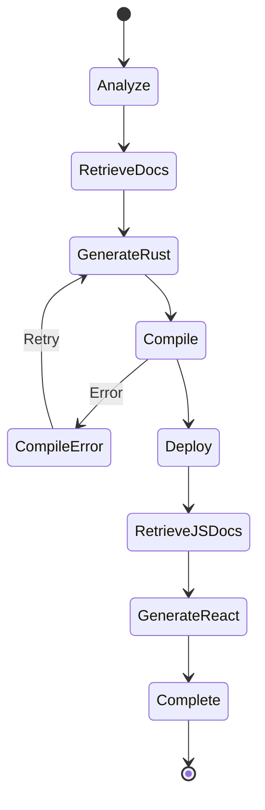
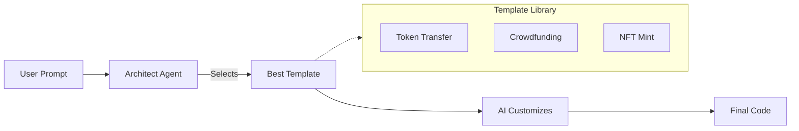

# Halo MVP Implementation Plan

## Architecture Overview




---

## Project Structure

```
halo/
├── frontend/                    # Next.js 14 App (Halo Studio)
│   ├── app/
│   │   ├── layout.tsx
│   │   ├── page.tsx
│   │   └── api/                 # API routes (proxy to backend)
│   ├── components/
│   │   ├── chat/
│   │   │   ├── ChatSidebar.tsx
│   │   │   ├── MessageList.tsx
│   │   │   └── PromptInput.tsx
│   │   ├── preview/
│   │   │   ├── SandpackPreview.tsx
│   │   │   ├── FileTree.tsx     # Toggle-able file tree (like v0)
│   │   │   └── BuildStatus.tsx
│   │   └── ui/                  # shadcn components
│   ├── hooks/
│   │   └── useContract.ts
│   ├── lib/
│   │   └── api.ts
│   └── styles/
│
├── backend/                     # FastAPI + LangGraph
│   ├── app/
│   │   ├── main.py              # FastAPI entry
│   │   ├── api/
│   │   │   └── routes/
│   │   │       └── generate.py  # /api/v1/generate endpoint
│   │   ├── core/
│   │   │   ├── config.py
│   │   │   └── llm.py           # Ollama client (local Kimi-k2.5)
│   │   ├── agents/
│   │   │   ├── orchestrator.py  # LangGraph state machine
│   │   │   ├── architect.py     # Semantic analysis + template selection
│   │   │   ├── rust_agent.py    # Soroban code customizer
│   │   │   └── react_agent.py   # Frontend code customizer
│   │   ├── services/
│   │   │   ├── compiler.py      # Docker compilation
│   │   │   └── deployer.py      # Stellar deployment
│   │   ├── templates/           # PRE-BUILT TEMPLATES (NEW)
│   │   │   ├── contracts/       # Soroban contract templates
│   │   │   │   ├── token_transfer/
│   │   │   │   │   ├── lib.rs
│   │   │   │   │   └── Cargo.toml
│   │   │   │   ├── crowdfunding/
│   │   │   │   │   ├── lib.rs
│   │   │   │   │   └── Cargo.toml
│   │   │   │   └── nft_mint/
│   │   │   │       ├── lib.rs
│   │   │   │       └── Cargo.toml
│   │   │   └── frontend/        # React scaffold templates
│   │   │       ├── base/        # Base Next.js scaffold
│   │   │       │   ├── App.jsx
│   │   │       │   ├── index.css
│   │   │       │   └── package.json
│   │   │       └── components/  # Pre-built components
│   │   │           ├── WalletConnect.jsx
│   │   │           ├── TxStatus.jsx
│   │   │           ├── ContractForm.jsx
│   │   │           └── BalanceDisplay.jsx
│   │   ├── db/
│   │   │   ├── models.py
│   │   │   └── session.py
│   │   └── rag/                 # RAG SYSTEM (NEW)
│   │       ├── indexer.py       # Scrape & index Stellar docs
│   │       ├── retriever.py     # Query ChromaDB for relevant docs
│   │       ├── embeddings.py    # Ollama embedding client
│   │       └── prompts.py       # Prompt templates with doc context
│   ├── knowledge/               # STELLAR DOCS (NEW)
│   │   ├── scraped/             # Raw scraped docs (markdown)
│   │   │   ├── soroban-sdk/
│   │   │   ├── stellar-sdk-js/
│   │   │   └── soroban-examples/
│   │   └── chroma_db/           # ChromaDB vector store
│   ├── scripts/
│   │   └── index_docs.py        # One-time doc indexing script
│   ├── docker/
│   │   └── soroban-builder/
│   │       └── Dockerfile
│   └── requirements.txt
│
├── docker-compose.yml           # Local dev setup
├── .env.example
└── design.md
```

---

## Phase 1: Project Setup

### 1.1 Frontend Setup (Next.js 14)

- Initialize Next.js 14 with App Router, TypeScript, Tailwind CSS
- Install shadcn/ui and configure dark theme
- Install Sandpack (`@codesandbox/sandpack-react`)
- Install Stellar packages (`@stellar/freighter-api`, `@stellar/stellar-sdk`)
- Install state management (`zustand`)

### 1.2 Backend Setup (FastAPI)

- Initialize FastAPI project with async support
- Install LangGraph, LangChain for orchestration
- Install ChromaDB for vector storage
- Install httpx for Ollama API calls (LLM + embeddings)
- Install `docker` Python SDK for container management
- Install `stellar-sdk` for Python
- Install `asyncpg` + `sqlalchemy` for PostgreSQL
- Configure Ollama client (connects to local `http://localhost:11434`)

### 1.3 Docker Setup

- Create custom Soroban builder image based on `stellar/soroban-tools`
- Configure `docker-compose.yml` with:
  - PostgreSQL container
  - Backend service
  - Frontend service (dev mode)

---

## Phase 2: Backend - LangGraph Orchestrator

### 2.1 State Machine Design




### 2.2 Key Files to Implement

`**backend/app/agents/orchestrator.py**` - LangGraph state machine with nodes:

- `analyze_prompt` - Architect agent parses user intent
- `generate_rust` - Rust agent creates Soroban contract
- `compile_contract` - Invokes Docker compiler
- `deploy_contract` - Deploys to Stellar Testnet
- `generate_frontend` - React agent creates UI code

`**backend/app/core/llm.py**` - Ollama client (local, free) with:

- Local Ollama endpoint (`http://localhost:11434/api/generate`)
- Kimi-k2.5 model via Ollama
- Async API calls via `httpx`
- Retry logic with exponential backoff
- Prompt templates for each agent type

`**backend/app/services/compiler.py**` - Docker compilation:

- Spin up ephemeral container from `soroban-builder` image
- Mount generated `lib.rs` into `/workspace/src/`
- Run `soroban contract build`
- Extract `.wasm` from container
- 60-second timeout with cleanup

`**backend/app/services/deployer.py**` - Stellar deployment:

- Server-side hot wallet (funded via Friendbot)
- Upload WASM to Stellar Testnet
- Create contract instance
- Return Contract ID

---

## Phase 3: RAG System - Stellar Docs Knowledge Base

### 3.1 Architecture




### 3.2 Documentation Sources


| Source           | URL                                            | Content                              |
| ---------------- | ---------------------------------------------- | ------------------------------------ |
| Soroban SDK      | developers.stellar.org/docs/tools/sdks/library | Rust SDK reference, types, functions |
| Stellar SDK JS   | stellar.github.io/js-stellar-sdk               | Frontend integration, RPC calls      |
| Soroban Examples | github.com/stellar/soroban-examples            | Reference contract implementations   |


### 3.3 Key Files to Implement

`**backend/scripts/index_docs.py**` - One-time indexing script:

- Scrape official Stellar docs (BeautifulSoup or playwright)
- Convert to markdown, chunk by section (500-1000 tokens)
- Generate embeddings via Ollama (`nomic-embed-text`)
- Store in ChromaDB with metadata (source, section, url)

`**backend/app/rag/embeddings.py**` - Ollama embedding client:

```python
async def get_embedding(text: str) -> list[float]:
    response = await httpx.post(
        f"{OLLAMA_BASE_URL}/api/embeddings",
        json={"model": "nomic-embed-text", "prompt": text}
    )
    return response.json()["embedding"]
```

`**backend/app/rag/retriever.py**` - ChromaDB query:

- Query with user prompt + template type
- Return top-k (5-10) most relevant doc chunks
- Include source URLs for reference

`**backend/app/rag/prompts.py**` - Context-aware prompts:

- Inject retrieved docs into system prompt
- Format: "Use the following Stellar documentation as reference: {docs}"

### 3.4 Updated LangGraph Flow




New nodes added:

- `RetrieveDocs` - Fetch relevant Soroban SDK docs before Rust generation
- `RetrieveJSDocs` - Fetch relevant Stellar JS SDK docs before React generation

---

## Phase 4: Frontend - Halo Studio

### 3.1 Layout Structure

```
+------------------+--------------------------------+
|                  |                                |
|   Chat Sidebar   |      Sandpack Preview          |
|   (300px fixed)  |      (flex-grow)               |
|                  |                                |
|  [Messages...]   |   +------------------------+   |
|                  |   |  Generated DApp        |   |
|                  |   |  (live preview)        |   |
|                  |   +------------------------+   |
|                  |                                |
|  [Build Status]  |   [Code] [Preview] [Console]  |
|  [Prompt Input]  |                                |
+------------------+--------------------------------+
```

### 3.2 Key Components

`**ChatSidebar.tsx**` - Collapsible sidebar with:

- Message history with AI/User distinction
- Real-time build status indicators (streaming SSE)
- Prompt input with submit handling

`**SandpackPreview.tsx**` - Sandpack configuration:

- Pre-loaded dependencies: `@stellar/freighter-api`, `@stellar/stellar-sdk`
- Custom `useContract` hook injected into all generated projects
- Dark theme matching Halo Studio

`**BuildStatus.tsx**` - Visual pipeline:

- Steps: Analyzing → Generating Contract → Compiling → Deploying → Generating UI
- Progress indicators with logs

### 3.3 State Management (Zustand)

```typescript
interface HaloStore {
  messages: Message[];
  buildStatus: BuildStep;
  generatedFiles: Record<string, string>;
  contractId: string | null;
  isBuilding: boolean;
  // actions
  sendPrompt: (prompt: string) => Promise<void>;
  reset: () => void;
}
```

---

## Phase 5: API Integration

### 4.1 SSE Streaming (`POST /api/v1/generate`)

Backend streams events as the pipeline progresses:

1. `status_update` - Current step name + message
2. `compilation_log` - Real-time cargo output
3. `deployment_success` - Contract ID
4. `files` - Generated React code
5. `complete` - Final success/error

Frontend consumes via `EventSource` or fetch with `ReadableStream`.

---

## Phase 6: Template System (v0-style)

### 5.1 How It Works




Instead of generating from scratch, the AI:

1. **Architect Agent** analyzes the prompt and selects the best matching template
2. **Rust Agent** receives the template + customization instructions
3. **React Agent** receives the base scaffold + components to compose

### 5.2 Contract Templates

`**templates/contracts/token_transfer/lib.rs**` - Base transfer contract:

- `transfer(to, amount)` - Send native XLM or custom token
- `get_balance(address)` - Query balance
- AI customizes: function names, validation logic, events

`**templates/contracts/crowdfunding/lib.rs**` - Crowdfunding contract:

- `contribute(amount)` - Add funds to campaign
- `withdraw()` - Creator withdraws if goal met
- `refund()` - Contributors refund if goal not met
- AI customizes: goal amount, deadline logic, tiers

`**templates/contracts/nft_mint/lib.rs**` - NFT minting contract:

- `mint(metadata_uri)` - Mint new NFT
- `transfer_nft(to, token_id)` - Transfer ownership
- `get_owner(token_id)` - Query owner
- AI customizes: supply limits, pricing, metadata schema

### 5.3 Frontend Component Templates

Pre-built components the AI composes together:


| Component            | Purpose                           | Customization Points           |
| -------------------- | --------------------------------- | ------------------------------ |
| `WalletConnect.jsx`  | Freighter wallet button           | Button text, styling           |
| `TxStatus.jsx`       | Toast notifications for tx status | Messages, styling              |
| `ContractForm.jsx`   | Dynamic form from contract ABI    | Fields, validation, labels     |
| `BalanceDisplay.jsx` | Show XLM/token balance            | Token symbol, refresh interval |


### 5.4 Template Selection Logic

The Architect Agent uses this decision tree:

```
IF prompt mentions "send", "transfer", "pay" → token_transfer
IF prompt mentions "raise", "fund", "goal", "campaign" → crowdfunding  
IF prompt mentions "NFT", "mint", "collectible", "art" → nft_mint
ELSE → token_transfer (default, most versatile)
```

### 5.5 File Tree UI (Toggle-able)

Users can toggle a file tree panel showing:

```
📁 my-dapp/
├── 📄 App.jsx          ← AI customized
├── 📄 index.css
├── 📁 components/
│   ├── 📄 WalletConnect.jsx
│   ├── 📄 TxStatus.jsx
│   └── 📄 ContractForm.jsx  ← AI customized
├── 📁 hooks/
│   └── 📄 useContract.js
└── 📄 package.json
```

Files marked with indicators for:

- Pre-built (from template)
- AI-customized
- AI-generated (new)

---

## Phase 7: Prompt Templates

### 7.1 Architect Agent Prompt

Analyzes user intent, selects best template from library, identifies customization points. Outputs structured spec with template choice.

### 7.2 Rust Agent Prompt

Receives template + customization spec. Modifies only necessary parts:

- Function names/signatures as needed
- Business logic (validation, conditions)
- Error messages
- Events/logging

### 7.3 React Agent Prompt

Receives base scaffold + component list. Composes and customizes:

- Which pre-built components to include
- Form fields based on contract ABI
- Labels, button text, copy
- Layout arrangement

---

## Key Technical Decisions


| Decision      | Choice                    | Rationale                                      |
| ------------- | ------------------------- | ---------------------------------------------- |
| LLM           | Ollama (local)            | Free, no API costs, runs Kimi-k2.5 locally     |
| Embeddings    | Ollama (nomic-embed-text) | Free, local, fast embeddings for RAG           |
| Vector DB     | ChromaDB                  | Lightweight, in-process, no extra containers   |
| RAG Strategy  | Query-time retrieval      | Fetch relevant docs per request, always fresh  |
| Streaming     | SSE (Server-Sent Events)  | Simpler than WebSockets for one-way updates    |
| Docker SDK    | Python `docker` package   | Native async support, good error handling      |
| State Machine | LangGraph                 | Built for agent orchestration, handles retries |
| Preview       | Sandpack                  | Battle-tested, supports custom dependencies    |
| Hot Wallet    | Server-managed            | Users don't pay gas, simpler UX for MVP        |
| Network       | Stellar Testnet           | Safe for development, free via Friendbot       |


---

## Environment Variables Needed

```env
# LLM (Ollama - local, free)
OLLAMA_BASE_URL=http://localhost:11434
OLLAMA_MODEL=kimi-k2.5
OLLAMA_EMBED_MODEL=nomic-embed-text

# RAG (ChromaDB - local)
CHROMA_PERSIST_DIR=./knowledge/chroma_db
RAG_TOP_K=5

# Stellar (Testnet only)
STELLAR_NETWORK=testnet
STELLAR_HORIZON_URL=https://horizon-testnet.stellar.org
STELLAR_HOT_WALLET_SECRET=   # Funded via Friendbot

# Database
DATABASE_URL=postgresql://...

# Docker
DOCKER_TIMEOUT_SECONDS=60
```

---

## MVP Scope Boundaries

**In Scope:**

- Single contract generation per prompt
- Stellar Testnet deployment
- Basic React UI generation
- Sandpack live preview
- Real Docker compilation

**Out of Scope (V2+):**

- Multi-contract orchestration
- Contract upgrades
- Mainnet deployment
- User authentication
- Project persistence/history
- One-click Vercel deployment

